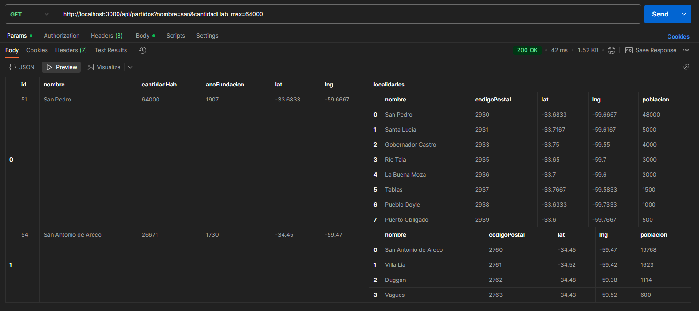
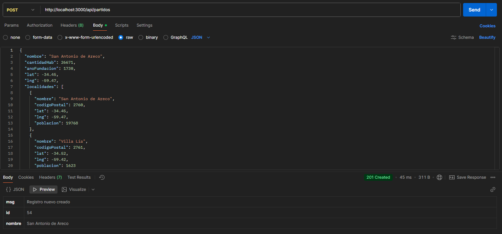
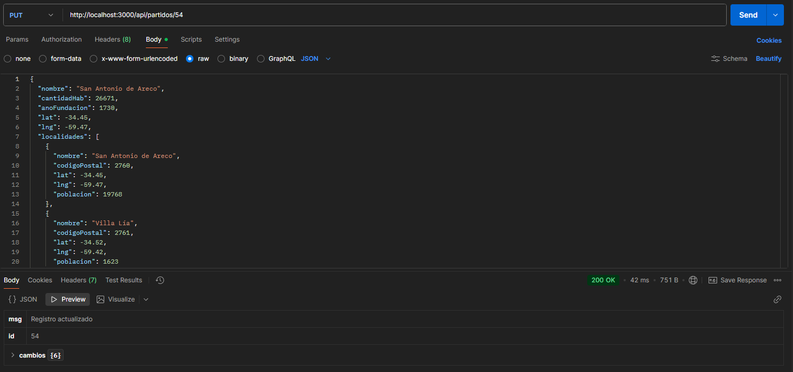

<!--
 Si queres ver este documento en HTML, estando en Visual Studio Code:
 - Presiona F1 y luego busca o selecciona: Markdown: Abrir vista previa
 - Y listo, tendras otra pestaña con la vista renderizada del documento
-->
# BA - PARTIDOS API

## 1. Descripción
API REST que expone los 135 partidos de la provincia de Buenos Aires (actualmente 53), sus localidades, código postal, año de fundación, latitud, longitud y cantidad de habitantes. Ideal para apps de geografía argentina.
Se eligio este tema con datos reales, para que se pueda utilizar en el futuro en sistemas de gestion basados en Web.
Los datos provienen de INDEC, IGN Argentina y el listado oficial de CPA (Códigos Postales Argentinos).
Poblaciones redondeadas a 2022 (CENSO) y fundaciones tomadas del decreto de creación de cada partido.

## 2. Arquitectura
MVC + JSON file como persistencia.
Validacion y logger incorporados.
* La estructura esta dividida en (Modelos, Vistas, Controlador, Middlewares, Data)
    - **Modelos:** El modelo gestiona los datos y la lógica de negocio de la aplicación, incluyendo operaciones como consultas, actualizaciones y validaciones, y puede interactuar con bases de datos o servicios externos.
    El modelo no tiene conocimiento directo de la vista, aunque puede notificar a la vista de cambios mediante patrones como el Observador.
    - **Vistas:** La vista se encarga de la presentación y representación visual de la información, generando la interfaz de usuario que el usuario final interactúa.
    La vista obtiene los datos del modelo para mostrarlos, pero no debe contener lógica de negocio ni controlar el flujo de la aplicación.
    - **Controlador:** El controlador actúa como intermediario entre el modelo y la vista, gestionando las interacciones del usuario, como clics o envíos de formularios.
    Cuando el usuario realiza una acción, el controlador recibe la solicitud, interactúa con el modelo para obtener o modificar datos, y luego envía la información actualizada a la vista para que se muestre.

## 3. Endpoints

| Método | Ruta                          | Descripción                          |
|--------|-------------------------------|--------------------------------------|
| GET    | /api/partidos                 | Todos los partidos                   |
| GET    | /api/partidos/:id             | Un partido por ID (1-53)             |
| GET    | /api/partidos?nombre=San, Bara...   | Filtra por coincidencia parcial o total en "partido" (uno o mas) |
| GET    | /api/partidos?nombre=baradero&anoFundacion=1784    | Filtra por partidos que contengan "baradero" en el nombre **y** fundados en 1784 |
| GET    | /api/partidos?cantidadHab_min=100000&cantidadHab_max=500000  | Filtra por partidos entre 100 mil y 500 mil habitantes |
| GET    | /api/partidos?nombre=san&cantidadHab_min=20000               | partidos que tengan "san" en el nombre **y** 20 mil o más habitantes |
| POST   | /api/partidos                 | Crea nuevo partido                   |
| PUT    | /api/partidos/:id             | Actualiza un partido                 |
| DELETE | /api/partidos/:id             | Elimina un partido                   |
| GET    | /api/partidos/stats           | Extra: cantidad total + promedio hab |


## Ejemplos de uso
**Lista total:**
```text
GET    /api/partidos
```
**Busqueda por partido:**
```text
GET    /api/partidos/:id
```
**Busqueda por filtros simples y avanzados**
```text
GET    /api/partidos?nombre=San Pedro, Baradero
GET    /api/partidos?nombre=baradero&anoFundacion=1784
GET    /api/partidos?cantidadHab_min=100000&cantidadHab_max=500000
GET    /api/partidos?nombre=san&cantidadHab_min=20000
```
**Carga de nuevos registros**
```text
POST   /api/partidos (Ver Body POST/DELETe de ejemplo)
```
**Actualizacion de registros**
```text
PUT    /api/partidos/7 (Ver Body PUT de ejemplo)
```
**Eliminacion de registros**
```text
DELETE /api/partidos/11
```
**Estadisticas de registros**
```text
GET    /api/partidos/stats
```

### Body ejemplo POST/DELETE (Usarse para pruebas)
```json
{
  "nombre": "San Antonio de Areco",
  "cantidadHab": 26671,
  "anoFundacion": 1730,
  "lat": -34.45,
  "lng": -59.47,
  "localidades": [
    { "nombre": "San Antonio de Areco", "codigoPostal": 2760, "lat": -34.45, "lng": -59.47, "poblacion": 19768 },
    { "nombre": "Villa Lía", "codigoPostal": 2761, "lat": -34.52, "lng": -59.42, "poblacion": 1623 },
    { "nombre": "Duggan", "codigoPostal": 2762, "lat": -34.48, "lng": -59.38, "poblacion": 1114 },
    { "nombre": "Vagues", "codigoPostal": 2763, "lat": -34.43, "lng": -59.52, "poblacion": 600 }
  ]
}
```
### Body ejemplo PUT selectivo (Para actualizar todo o campos especificos)
#### Aqui estamos actualizando un partido, localidad, o el campo que se elija (El registro debe existir, el Codigo Postal debe existir).
```json
{
  "nombre": "Baradero", // Esta linea puede o no estar presente
  "localidades": [
    {
      "codigoPostal": 2942,
      "nombre": "Baradero Ciudad"
    }
  ]
}
```
#### Aqui se esta actualizando el registro, pero agregando una localidad completa (No hace falta que el Codigo Postal exista).
```json
{
  "localidades": [
    { "nombre": "Vagues", "codigoPostal": 2763, "lat": -34.43, "lng": -59.52, "poblacion": 600 }
  ]
}
```

## Ejemplo de Uso
```text
PUT /api/partidos/11
Content-Type: application/json
```

## 4. Middlewares implementados

- **Middleware:** El middleware en una API REST actúa como una capa de procesamiento que se sitúa entre el cliente y el servidor, gestionando las solicitudes y respuestas que fluyen entre ambos.
Esencialmente, es una función que tiene acceso al objeto de solicitud (req), al objeto de respuesta (res) y a la siguiente función de middleware en el ciclo de solicitud/respuesta, denotada comúnmente como next.
    - **Logger:** El middleware de registro (logger), que registra información sobre cada solicitud entrante  y la respuesta generada. En frameworks como Express.js, se puede crear un middleware que imprima el método HTTP y la ruta de la solicitud antes de que se procese, y luego registre el código de estado de la respuesta. En nuestro caso creamos un archivo logs.txt que contiene metodo (GET, POST, PUT, DELETE), ruta en la que se ejecuta, fecha y hora de la consulta.
    - **Validador:** Otro ejemplo clave es el middleware validador, que se encarga de verificar ciertos aspectos de la solicitud antes de que se procese. En nuestro caso se verifica que el body POST / PUT tenga la estructura y tipo de datos correctos.

## 5. Validaciones

- No envíes `ID` al crear un partido (`POST`). El servidor asigna automáticamente el siguiente número entero consecutivo.
- No se permite repetir el **nombre** de un partido (mayúsculas/minúsculas indistintas). Si intentas duplicarlo, la API responde `409 Conflict`.
- Verifica que el nombre del **partido** sea un `string` - error: `Nombre inválido`
- Verifica que el nombre del **partido** no exista - error: `Nombre de partido duplicado`
- Cantidad de habitantes que sea un numero entero mayor o igual a 0 de lo contrario - error: `Cantidad de Habitantes inválido`
- Año de fundacion mayor a 1515 y menor a 2023 - error: `Año de Fundación inválido`
- Mira que Localidades sea un Array y que no este vacio - error: `Localidades inválido`
- Tambien se controla individualmente el nombre y que el codigo postal sea un numero entero - error: `Localidad inválida`

### ¿Qué garantiza este código?
- Que se reciba un array no vacío.
- Que cada elemento tenga un nombre válido y un código postal entero.
- Si todo está bien, el código continúa.

## 6. Ejemplos de uso en POSTMAN
### Prueba de GET (Consultar registro de forma General, por ID, por Filtro)

---

---

---


### Prueba de POST (Crear un registro)


### Prueba de PUT (Actualizar un registro)


### Prueba de DELETE (Eliminar un registro)


## 7. Conclusiones
### Cómo se hizo este proyecto
#### Desarrollar una API REST que expusiera la información de los partidos de la provincia de Buenos Aires fue, sin exagerar, uno de los desafíos más enriquecedores que he enfrentado en mi formación como desarrollador. El camino estuvo lleno de curvas de aprendizaje empinadas, errores que obligaron a rehacer líneas de código y, sobre todo, de pequeñas victorias que reforzaron la teoría vista en clase.

**1. Punto de partida:** la consigna y el "blanco en la pared"
**El objetivo inicial parecía sencillo:** "crear un servicio que permita listar, crear, actualizar y eliminar partidos" (CRUD). Sin embargo, rápidamente aparecieron matices que complicaban la ecuación:
- Validar que no se repitiera ni el id ni el nombre de un partido.
- Generar ids autoincrementales al crear un nuevo registro.
- Quitar el campo id de las localidades para simplificar el esquema.
- Soportar filtros múltiples y combinables (nombre, año de fundación, cantidad de habitantes, etc.).
- Manejar errores con mensajes claros y códigos HTTP apropiados.
- Cada nuevo requerimiento fue una oportunidad de profundizar en conceptos que, hasta entonces, solo conocía de forma teórica.

**2. Herramientas y tecnologías**

 |Tecnología                |	Uso en el proyecto                                                                        |
 |--------------------------|-------------------------------------------------------------------------------------------|
 |Node.js + Express         |	Servidor y enrutamiento de la API.                                                        |
 |JavaScript vanilla        |	Lógica de negocio y middlewares.                                                          |
 |JSON plano                |	Persistencia temporal (archivo partidos.json).                                            |
 |Postman / Thunder Client  |	Pruebas de endpoints y regresiones.                                                       |
 |Git                       |	Control de versiones y múltiples intentos.                                                |
 |IA generativa             |	Verificación de sintaxis, explicación de errores y generación de comentarios descriptivos.|

**3. Metodología de trabajo**
- **Diagrama de rutas primero:** antes de tocar código, dibujé en papel el flujo GET > POST > PUT > DELETE y los posibles códigos de respuesta.
- **Desarrollo en capas:**
- Rutas (Vista) → Controladores → Modelo → Persistencia.
- Cada capa con una responsabilidad única.
- **Commits pequeños:** cada vez que un endpoint respondía 200 OK, commit.
- **Refactor seguro:** una vez que los tests en Postman pasaban, volvía al código a limpiar nombres de variables y agregar try/catch.
- **Documentación al final:** README.md con ejemplos de llamadas y códigos de respuesta.

**4. Dificultades que se presentaron**

|Dificultad                   |Cómo se resolvió                   |Aprendizaje clave                  |
|-----------------------------|-----------------------------------|-----------------------------------|
|Validar duplicados sin romper el PUT	|Agregar una condición extra en el .some() que excluyera el id del registro que se estaba actualizando.	|Entender que "duplicado" es relativo al contexto.|
|Generar ids autoincrementales	|Calcular maxId con reduce antes de insertar.	|Nunca confiar en un id que viene del cliente en un POST.|
|Filtrar por múltiples parámetros	|Crear un objeto filtros dinámico y una función filtrarAvanzado() que aplique todos los criterios en cadena.	|Principio de responsabilidad única: un solo lugar decide si un registro "pasa" o no.|
|Manejo de errores	|Envolver conversiones numéricas (Number(...)) dentro de try/catch y devolver 400 con mensajes descriptivos.	|El usuario jamás debe ver un stack trace; siempre un JSON con error.|
|Quitar id de localidades	|Revisar todo el archivo JSON de ejemplo y asegurarse de que ninguna función intentara leer/escribir ese campo.	|La consistencia de datos es tan importante como el código.|

**5. Aporte de la IA**
**Utilicé la IA como par de programación virtual:**
- Verificación rápida de sintaxis al pegar bloques.
- Explicación paso a paso de por qué filter + some es más claro que un for anidado.
- Generación de comentarios en español para no perder tiempo.
- Propuesta de estructuras de control (por ejemplo, usar reduce para el id autoincremental).
- Sin embargo, cada sugerencia fue revisada y adaptada; nunca se copió-pego ciego. La IA aceleró, pero no reemplazó el pensamiento crítico.

**6. Conclusión personal**
Terminar el proyecto y ver cómo Postman devuelve exactamente lo que esperaba fue una sensación de logro difícil de describir. Más allá del código, aprendí a:
* Planificar antes de escribir.
* Leer errores de consola sin pánico.
* Documentar para el "yo" del futuro.
* Confiar en mi capacidad de resolver problemas, aunque al principio parezcan gigantes.
* La API hoy está funcionando, pero la sensación de "yo lo construí, entiendo cada línea y sé por qué está ahí" es el verdadero entregable.

## 8. Instalacion y Pruebas
- **A** -> Descarga el proyecto en ZIP o clona el repositorio `https://github.com/rquispe75/API-Partidos-AR.git`.
- **B** -> Instala las dependencias con `npm install`.
- **C** -> Inicia el servidor con `npm start`. 
- **D** -> Realiza las pruebas en Postman segun los `endpoints` descriptos anteriormente.
