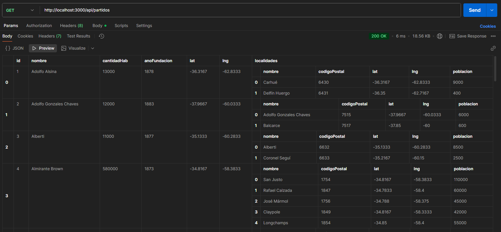

# BA - PARTIDOS API

## 1. Descripción
API REST que expone los 135 partidos de la provincia de Buenos Aires (actualmente 50), sus localidades, código postal, año de fundación, latitud, longitud y cantidad de habitantes. Ideal para apps de geografía argentina.
Se eligio este tema con datos reales, para que se pueda utilizar en el futuro en sistemas de gestion basados en Web.
Los datos provienen de INDEC, IGN Argentina y el listado oficial de CPA (Códigos Postales Argentinos).
Poblaciones redondeadas a 2022 (CENSO) y fundaciones tomadas del decreto de creación de cada partido.

## 2. Arquitectura
MVC + JSON file como persistencia.
Validacion y logger incorporados.
* La estructura esta dividida en (Modelos, Vistas, Controlador, Middlewares, Data)
    - **Modelos:** El modelo gestiona los datos y la lógica de negocio de la aplicación, incluyendo operaciones como consultas, actualizaciones y validaciones, y puede interactuar con bases de datos o servicios externos.
    El modelo no tiene conocimiento directo de la vista, aunque puede notificar a la vista de cambios mediante patrones como el Observador.
    - **Vistas:** La vista se encarga de la presentación y representación visual de la información, generando la interfaz de usuario que el usuario final interactúa.
    La vista obtiene los datos del modelo para mostrarlos, pero no debe contener lógica de negocio ni controlar el flujo de la aplicación.
    - **Controlador:** El controlador actúa como intermediario entre el modelo y la vista, gestionando las interacciones del usuario, como clics o envíos de formularios.
    Cuando el usuario realiza una acción, el controlador recibe la solicitud, interactúa con el modelo para obtener o modificar datos, y luego envía la información actualizada a la vista para que se muestre.

## 3. Endpoints

| Método | Ruta                          | Descripción                          | Ejemplo                          |
|--------|-------------------------------|--------------------------------------|----------------------------------|
| GET    | /api/partidos                 | Todos los partidos                   | /api/partidos                    |
| GET    | /api/partidos/:id             | Un partido por ID (1-50)             | /api/partidos/3                  |
| GET    | /api/partidos?nombre=San...   | Filtra por coincidencia en "partido" | /api/partidos?nombre=San...      |
| GET    | /api/partidos/resumen         | Listar Partido, Localidad, Hab y CP  | /api/partidos/resumen            |
| POST   | /api/partidos                 | Crea nuevo partido                   | Ver body abajo                   |
| PUT    | /api/partidos/:id             | Actualiza un partido                 | /api/partidos/7                  |
| DELETE | /api/partidos/:id             | Elimina un partido                   | /api/partidos/11                 |
| GET    | /api/partidos/stats           | Extra: cantidad total + promedio hab | /api/partidos/stats              |

### Body ejemplo POST
```json
{
  "id": 50,
  "nombre": "General Paz",
  "cantidadHab": 12000,
  "anoFundacion": 1876,
  "lat": -35.5333,
  "lng": -60.0333,
  "localidades": [
    { "id": 5001, "nombre": "General Paz", "codigoPostal": 6557, "lat": -35.5333, "lng": -60.0333, "poblacion": 11000 },
    { "id": 5002, "nombre": "Villa Saboya", "codigoPostal": 6558, "lat": -35.5667, "lng": -59.95, "poblacion": 1000 }
  ]
}
```
## 4. Middlewares implementados

- **Middleware:** El middleware en una API REST actúa como una capa de procesamiento que se sitúa entre el cliente y el servidor, gestionando las solicitudes y respuestas que fluyen entre ambos.
Esencialmente, es una función que tiene acceso al objeto de solicitud (req), al objeto de respuesta (res) y a la siguiente función de middleware en el ciclo de solicitud/respuesta, denotada comúnmente como next.
    - **Logger:** El middleware de registro (logger), que registra información sobre cada solicitud entrante  y la respuesta generada. En frameworks como Express.js, se puede crear un middleware que imprima el método HTTP y la ruta de la solicitud antes de que se procese, y luego registre el código de estado de la respuesta. En nuestro caso creamos un archivo logs.txt que contiene metodo (GET, POST, PUT, DELETE), ruta en la que se ejecuta, fecha y hora de la consulta.
    - **Validador:** Otro ejemplo clave es el middleware validador, que se encarga de verificar ciertos aspectos de la solicitud antes de que se procese. En nuestro caso se verifica que el body POST / PUT tenga la estructura y tipo de datos correctos.

## 5. Validaciones

- Nombre del Partido que sea un string - error: 'Nombre inválido'
- Cantidad de habitantes que sea un numero entero mayor o igual a 0 - error: 'Cantidad de Habitantes inválido'
- Año de fundacion mayor a 1515 y menor a 2023 - error: 'Año de Fundación inválido'
- Mira que Localidades sea un Array y que no este vacio - error: 'Localidades inválido'
- Tambien se controla individualmente el nombre y que el codigo postal sea  un numero entero - error: 'Localidad inválida'

### ¿Qué garantiza este código?
- Que se reciba un array no vacío.
- Que cada elemento tenga un nombre válido y un código postal entero.
- Si todo está bien, el código continúa.

## 6. Ejemplos de uso en POSTMAN
### Prueba de GET (Consultar registro de forma General, por ID, por Filtro)



### Prueba de POST (Crear un registro)


### Prueba de PUT (Actualizar un registro)


### Prueba de DELETE (Eliminar un registro)


## 7. Conclusiones
La realizacion de este proyecto, fue un gran desafio para mi. Me apoye en parte con la documentacion, clases, y teoria proporcionada. Tambien se utilizo IA para verificacion, completar codigo y explicaciones de las partes del codigo.